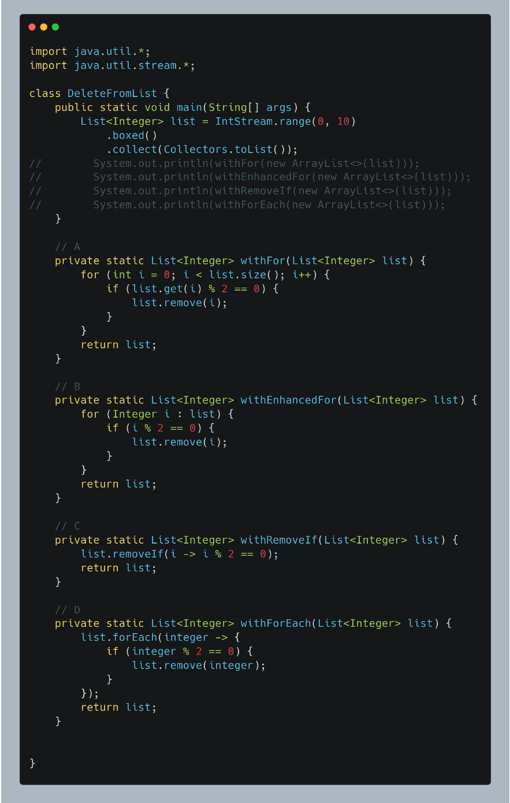
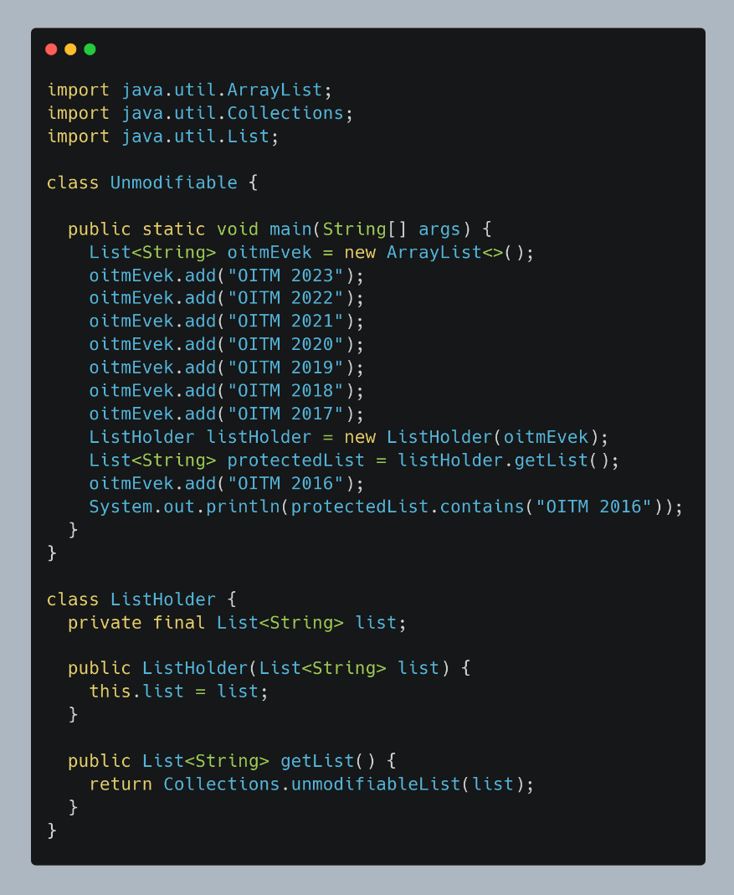
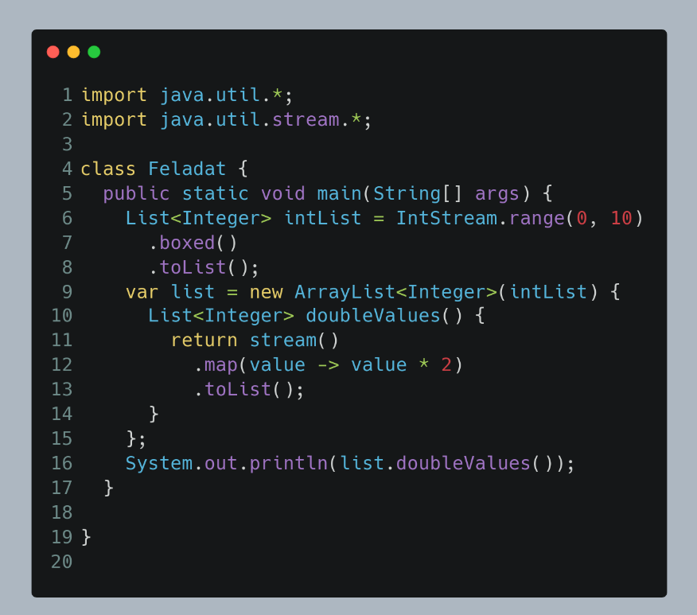
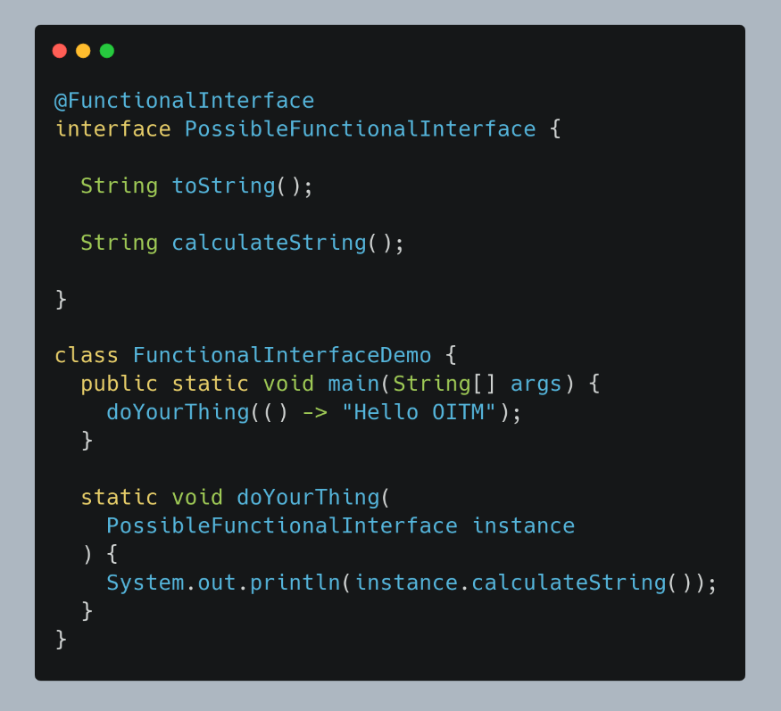
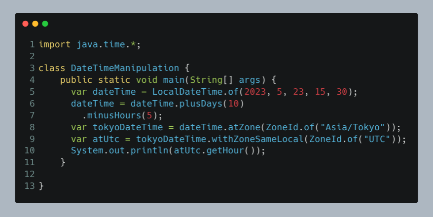

## 1. Válaszd ki mely állítások térnek vissza igazzal?
- "OITM" == "OITM"
- "OITM" == new String("OITM")
- "OITM" == new String("OITM").intern()
- "OITM " + "2023" == "OITM 2023"
- (Long)125L == (Long)125L
- (Long)128L == (Long)128L
- Integer.valueOf(-128) == Integer.valueOf(-128)
- Boolean.valueOf("false") == Boolean.valueOf("hamis")

## 2. Mely metódusokat használhatjuk arra, hogy a megadott listából a páros számokat kitöröljünk

- A
- B
- C
- D

## 3. Mi lesz a kimenetele a következő program futásának

- Fordítási hiba
- Futási hiba - UnsupportedOperationException
- true
- false

## 4. Mi lesz a kimenetele a következő program futásának

- Fordítási hiba
- Futási hiba
- [0, 2, 4, 6, 8, 10, 12, 14, 16, 18]
- [0, 1, 2, 3, 4, 5, 6, 7, 8, 9]
- [0, 2, 4, 6, 8, 10, 12, 14, 16, 18, 20]
- [0, 1, 2, 3, 4, 5, 6, 7, 8, 9, 10]

## 5. Mi lesz a kimenetele a következő program futásának

- Fordítási hiba - Egy funckionális interfész csak egy darab absztrakt metódussal rendelkezhet.
- Futási hiba - Bár a program lefordul, de futási időben a futtató nem tudja eldönteni, hogy a két String-et visszaadó metódus közül melyiket kell - lefuttatni.
- Hello OITM
- null - Mert a toString van hamarabb definiálva az interfészben, és ebben az esetben azt valósítjuk meg, így a calculateString null-t ad vissza.

## 6. Mi lesz a következő program futásának végeredménye

- ?